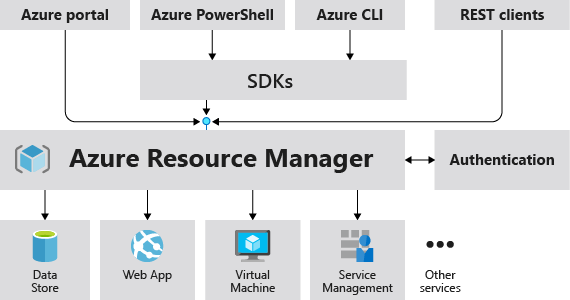

# Bicep 
# About
Bicep is a DSL created and maintained by Microsoft starting with v 0.3 onward. Bicep templates will compile into Azure Resource Manager (ARM) templates and are deployed similarly. In fact there is even a `decompile` which take a best guess conversion into a Bicep file. If you want can also run a `bicep build` command which will compile the Bicep file into an ARM template for evaluation.

# Some Pointers
- There is no state file
- Anything achievable in ARM can be done in Bicep
- Bicep is released monthly
- Day 1 support for any Azure resources, even those in private preview
- Azure is only provider available
- Easily declare individual Azure Resource provider API versions

# How It Works
The Azure CLI will compile a Bicep file into an ARM Template. This template will be sent directly to the Azure Resource Manager.

Source From: [Microsoft Docs](https://docs.microsoft.com/en-us/azure/azure-resource-manager/management/overview)

# PreReqs
- [Bicep Tools](https://docs.microsoft.com/en-us/azure/azure-resource-manager/bicep/install#vs-code-and-bicep-extension)

# Validating Changes
The best way to validate changes would be to leverage the Azure CLI `what-if` command similar to:
` az deployment sub what-if --location EastUS --name azureADOCLIDeployment --template-file main.bicep --parameters parameters/dev.eus.parameters.json`

For more information check ouf the [ARM Template deployment what-if operation](https://docs.microsoft.com/en-us/azure/azure-resource-manager/templates/deploy-what-if?tabs=azure-powershell)

# Deploying
Deployment for these examples are done at the Subscription level. This is done to ensure full deployment by creating the required Resource Group.

`az deployment sub create --name storageDeployment --location eastus --template-file main.bicep --parameters parameters/dev.eus.parameters.json`

# Links
- [GitHub Project Site](https://github.com/Azure/bicep)
- [Microsoft Learning Path](https://docs.microsoft.com/en-us/learn/paths/fundamentals-bicep/)
- [Bicep Community Calls](https://www.youtube.com/channel/UCZZ3-oMrVI5ssheMzaWC4uQ/videos)
- [Bicep Resource Schemas](https://docs.microsoft.com/en-us/azure/templates/)
- [Microsoft Azure Quickstarts](https://azure.microsoft.com/en-us/resources/templates/)
- [Bicep to ARM Playground](https://bicepdemo.z22.web.core.windows.net/)