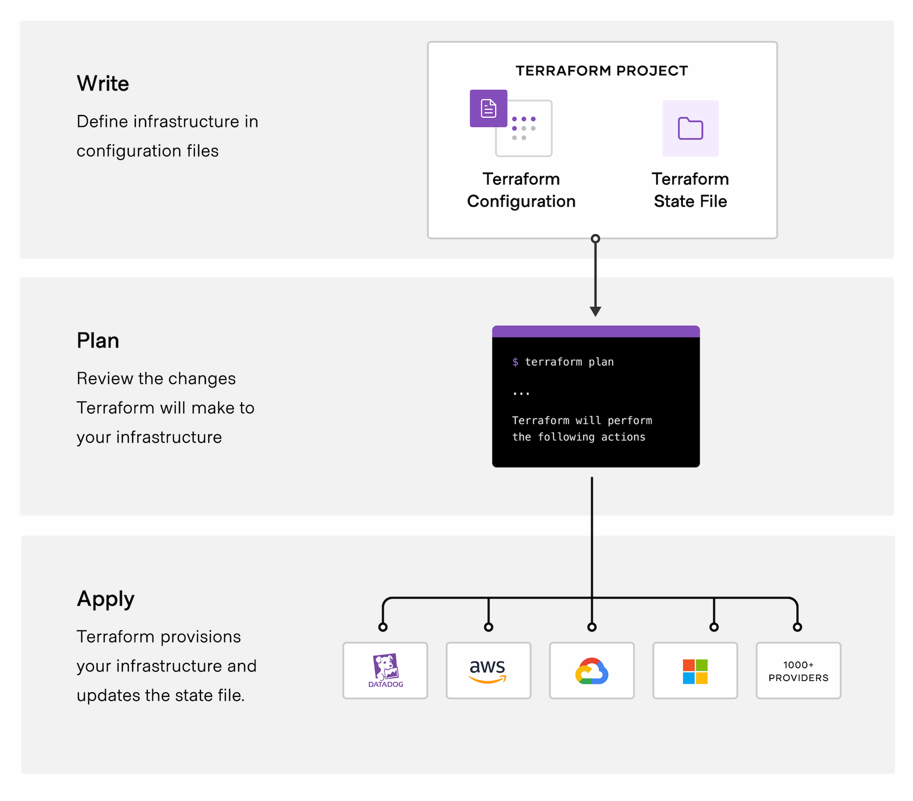

# Terraform 

# About
Per Hashicorp Terraform is:
>
HashiCorp Terraform is an infrastructure as code tool that lets you define both cloud and on-prem resources in human-readable configuration files that you can version, reuse, and share. You can then use a consistent workflow to provision and manage all of your infrastructure throughout its lifecycle. Terraform can manage low-level components like compute, storage, and networking resources, as well as high-level components like DNS entries and SaaS features.
>
# Some Pointers
- There is [state file](https://www.terraform.io/language/state) that can be local stored, remote stored self-hosted, or remote hosted by Hashicorp
- Providers are open sourced
- Some providers won't be updated with Day 0 support
- Terraform itself is cloud agnostic, providers aren't
- When storing state remote, secrets are contained in plain text
- Managing/tracking provider and Terraform versions
- Multiple cloud and non cloud providers available
- Best practice tends to have use lower case and `_` in place of spaces

# Basic Flow

Sourced from: [Terraform.io](https://www.terraform.io/intro)

# Providers
[Providers](https://registry.terraform.io/browse/providers) are key factor when leveraging Terraform. >
>
Providers are a logical abstraction of an upstream API. They are responsible for understanding API interactions and exposing resources. 
>
Providers are maintained via open source and usually are endorsed by the organization they are for.
# PreReqs
- [Terraform](https://learn.hashicorp.com/tutorials/terraform/install-cli)

# Initializing Terraform
Before running any Terraform you need to initialized the working direction via [`terraform init`.](https://www.terraform.io/cli/commands/init)

For this repository just need to make sure the terminal is under the correct folder and simply run `terraform init`.

# Validating Changes
Since Terraform depends on a state file to contain a definition of the resources associated with the Terraform file it does a really good job at detecting any changes.

This is done via [`terraform plan`](https://www.terraform.io/cli/commands/plan)

For this repo it will look like:
`terraform plan -var-file="variables/dev.eus.variables.tfvars" ` 

# Deploying
Deployment is done using the [`terraform apply` command.](https://www.terraform.io/cli/commands/apply).

In this repo it would be:
`terraform apply -var-file="variables/dev.eus.variables.tfvars"   `

# Formatting
Terraform provides the ability to auto format your code. This can be accomplished via a [`terraform fmt` command](https://www.terraform.io/cli/commands/fmt)

For this repo all Terraform can be ran with a `terraform fmt -recursive` within the Terraform folder

# Links
- [Hashicorp](https://www.terraform.io/)
- [Azurerm Provider](https://registry.terraform.io/providers/hashicorp/azurerm/latest/docs)
- [AzAPI Provider](https://registry.terraform.io/providers/Azure/azapi/latest/docs)
- [Getting Started with Terraform for Azure](https://learn.hashicorp.com/collections/terraform/azure-get-started)